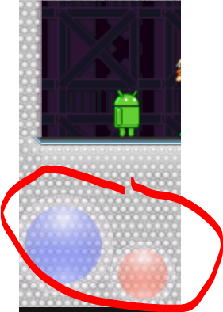
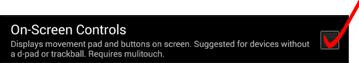

# Replica Island

A side scrolling video game for Android.

*Authors*: Chris Pruett and Genki Mine

This code and artwork is released under the Apache 2.0 license.  See LICENSE.TXT for details.

### ABOUT REPLICA ISLAND

Replica Island is a side-scrolling platformer for Android devices.
It stars the Android robot as its protagonist as he embarks on a dangerous mission
to find a mysterious power source.  This is a complete game: all art, dialog, level layouts,
and other data are included along with the code.

### ABOUT THE SOURCE

The code is structured into several Activities and DialogFragments for the main menu, level select, dialogs, and main game.
The core game logic is in `src/com/replica/replicaisland/AndouKun.kt`, which implements the main game Activity
(now extends AppCompatActivity for fragment support). "AndouKun" was the code name for this project
and you can find references to it all over the code.

**Modern Dialog Architecture**: The game uses DialogFragments for in-game dialogs:
- `DiaryDialogFragment` - Displays collected diary entries with animated background
- `ConversationDialogFragment` - Shows NPC conversations with typewriter text effect
- `LevelSelectDialogFragment` - Level selection using Fragment Result API for communication
- `GamepadOnboardingDialogFragment` - Gamepad detection dialog with graphical control diagram

The game loop itself is structured as follows:

AndouKun.java spins up the game, handles input events, deals with pausing and resuming,
and also manages the progression across game levels.

Game.java is a layer of abstraction between AndouKun.java and the game loop itself.
This class bootstraps the game, passes events through, and manages the game thread.

GameThread.java is the actual game loop.  It's main utility is to manage the main loop (MainLoop.java),
which implements the rest of the game logic.

MainLoop.java is the head of the game graph that describes the Replica Island runtime.
Anything managed by MainLoop will be polled once per frame, and children of MainLoop may
themselves have children which will be polled.  GameObjects are a specific type of game graph node
that only contain GameComponents as children.  GameComponents implement individual features
(collision detection, animation, rendering, etc) of individual game entities.
GameObjects are generally parented to GameObjectManager, which activates
and deactivates its children based on their proximity to the camera.
GameObjectManager is a child of MainLoop.

The last step in the GameThread is the rendering step.
Rendering does not occur in the game thread.  Instead, render commands are queued up by the game thread
and then handed to a separate render thread at a synchronization point.
The render thread is mostly implemented in GameRenderer.java, which is run by GLSurfaceView.java.

### KEY FILES

Here are some interesting files in this project.

res/raw/collision.bin: This is the raw collision data.  Line segments and normals.

tools/ExtractPoints.js: This is a (rather horrible) Javascript tool for Photoshop.
It will walk closed paths and produce a text layer describing them as line segments
and normals, organized by tile.  It takes a long time to run and is probably the worst code
in the entire project.  res/raw/collision.bin is the binary version of output from this tool.

res/xml/leveltree.xml: This file describes the non-linear level progression through the game.
It is a tree, each node of which may contain one or more levels.  Continuing to the next node requires
that all levels are completed.

src/com/replica/replicaisland/BaseObject.java and ObjectManager.java: These are the core nodes of the game graph.

### ABOUT THE AUTHORS

Chris Pruett wrote code, dialog, made sounds, and defined the core game design.

Genki Mine made all of the art, most of the levels layouts, all of the character designs,
most of the sound, and also contributed to the game design.

Tom Moss got the project up and running and then sat back and let us make it cool.

Special thanks to Jason Chen for awesome rah-rah cheerleading support,
Casey Richardson for excellent play testing and design feedback,
Tim Mansfield for dialog edits, all 1300 users who participated in beta testing,
and to the Android team for continued support.

### ADDENDUM

Jim Andreas converted the project to Kotlin, which is also another island.  "The game is afoot!"

IMPORTANT NOTE: the conversion is Komplete.  Linting runs clean and the game is playable.

This code was derived from the original code posted to the following link - still working
as of Sept 2025:

https://code.google.com/archive/p/replicaisland/

**Gamepad Controller Support**: Game controller support with joystick movement and button
mapping (A=jump, B=attack with long-press for possession orb). When a gamepad is connected
while on-screen controls are active, an onboarding dialog shows a graphical gamepad diagram
with control callouts and lets the user switch to gamepad mode with one tap.

**Modern Android Architecture**: Recent updates include:
- DialogFragment-based dialogs replacing legacy Activity dialogs
- PreferenceFragmentCompat for settings screen
- DataStore for preferences (migrated from SharedPreferences)
- Instrumented tests with Espresso and fragment-testing

## USAGE NOTES

On Android emulators at API23 (Marshmallow) the on screen controls appear to
not include the left-right slider:<br>



You can fix this by checking the box `On-Screen Controls` in the `Configure` menu:<br>



## Level Viewer Desktop Utility

A standalone Kotlin/JVM desktop tool that parses the game's binary level files and tile atlases to render overhead views of entire levels, similar to the original author's level visualizations.

**Launch:**
```bash
./gradlew :levelviewer:run
```

**Features:**
- Level selection tree organized by game progression groups
- Tile rendering using the game's theme-specific atlases (grass, island, sewage, cave, lab, tutorial)
- Collision overlay showing line segments from `collision.bin`
- Object spawn location visualization
- Zoom (mouse wheel) and pan (click-drag)
- Export to PNG

The viewer parses the same binary formats used by the game engine: level `.bin` files (signature 96), TiledWorld blocks (signature 42), and collision data (signature 52). All formats use little-endian byte order.

## Development Status

Actively maintained and updated for modern Android development practices.

Currently set up for:

**Android Studio Narwhal 4 Feature Drop | 2025.1.4**

Target SDK: 36 | Min SDK: 24