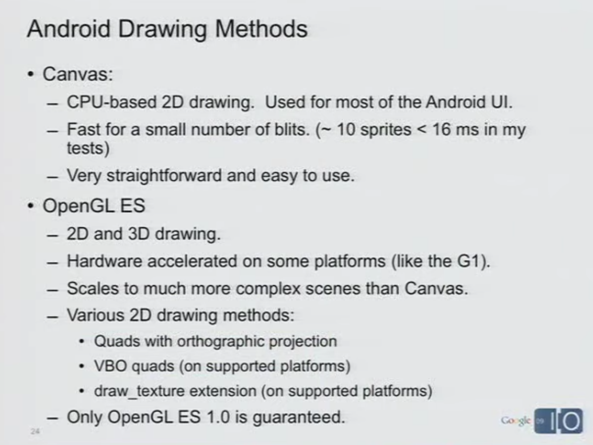

# Replica Island Technical presentation information

Click on an image for an enlarged view.  These
are screen captured images from the
presentations by Chris Pruett during Google I/O 2009 and 2010.
See the [Links](Links.md) for more information.

 

 

 

 

 

 

 

 

 

 

 

 

 
